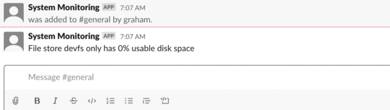

# 1. Introdução
O Slack é um sistema de chat popular usado por pessoas e empresas em todo o mundo. Uma das coisas que o torna tão popular é a capacidade de escrever nossos próprios plug-ins personalizados que podem interagir com pessoas e canais em um único slack. Isso usa sua API HTTP.

O Slack não oferece um SDK oficial para escrever plug-ins com Java. No entanto, existe um SDK da comunidade oficialmente endossado que iremos usar. Isso nos dá acesso a quase toda a API do Slack a partir de uma base de código Java sem a necessidade de nos preocuparmos com os detalhes exatos da API.

Faremos uso disso para construir um pequeno bot de monitoramento de sistema. Isso irá recuperar periodicamente o espaço em disco para o computador local e alertar as pessoas se alguma unidade estiver ficando muito cheia.

# 2. Obtenção de credenciais de API
Antes de podermos fazer qualquer coisa com o Slack, precisamos criar um novo aplicativo e um bot e conectá-lo aos nossos canais.

Em primeiro lugar, vamos visitar https://api.slack.com/apps. Esta é a base de onde gerenciamos nossos aplicativos do Slack. A partir daqui, podemos criar um novo aplicativo.

Quando fazemos isso, precisamos inserir um nome para o aplicativo e um espaço de trabalho do Slack para criá-lo.


Depois de fazer isso, o aplicativo foi criado e está pronto para trabalharmos. A próxima tela nos permite criar um Bot. Este é um usuário falso com o qual o plug-in atuará.

Como acontece com qualquer usuário normal, precisamos fornecer a ele um nome de exibição e um nome de usuário. Estas são as configurações que outros usuários no espaço de trabalho do Slack verão para este usuário bot se eles interagirem com ele.

Agora que fizemos isso, podemos selecionar “Instalar aplicativo” no menu lateral e adicionar o aplicativo ao nosso espaço de trabalho do Slack. Depois de fazer isso, o aplicativo pode interagir com nosso espaço de trabalho.


Isso nos dará os tokens de que precisamos para o nosso plugin se comunicar com o Slack.

Cada bot interagindo com um espaço de trabalho diferente do Slack terá um conjunto diferente de tokens. Nosso aplicativo precisa do valor “Bot User OAuth Access Token” para quando o executarmos.

Finalmente, precisamos convidar o bot para quaisquer canais nos quais ele deve estar envolvido. Isso funciona simplesmente enviando uma mensagem do canal - @system_monitoring neste caso.

# 3. Adicionando folga ao nosso projeto
Antes de podermos usá-lo, primeiro precisamos adicionar as dependências do Slack SDK ao nosso arquivo pom.xml:

```
<dependency>
    <groupId>com.hubspot.slack</groupId>
    <artifactId>slack-base</artifactId>
    <version>${slack.version}</version>
</dependency>
<dependency>
    <groupId>com.hubspot.slack</groupId>
    <artifactId>slack-java-client</artifactId>
    <version>${slack.version}</version>
</dependency>
```

# 3. Estrutura do aplicativo
O núcleo de nosso aplicativo é a capacidade de verificar se há erros no sistema. Vamos representar isso com o conceito de um Verificador de erros. Esta é uma interface simples com um único método, acionada para verificar se há erros e relatá-los:

```
public interface ErrorChecker {
    void check();
}
```

Também queremos ter os meios para relatar quaisquer erros encontrados. Esta é outra interface simples que pegará uma declaração do problema e relatará de forma apropriada:

```
public interface ErrorReporter {
    void reportProblem(String problem);
}
```

O uso de uma interface aqui nos permite ter diferentes maneiras de relatar problemas. Por exemplo, podemos ter um que envia e-mails, contata um sistema de relatório de erros ou envia mensagens ao nosso sistema Slack para que as pessoas recebam uma notificação imediata.

O design por trás disso é que cada instância de ErrorChecker recebe seu próprio ErrorReporter para usar. Isso nos dá a flexibilidade de ter diferentes relatadores de erros para diferentes verificadores usarem, porque alguns erros podem ser mais importantes do que outros. Por exemplo, se os discos estiverem mais de 90% cheios, isso pode exigir uma mensagem para um canal do Slack, mas se eles estiverem mais de 98% cheios, então podemos enviar mensagens privadas para pessoas específicas.

# 4. Verificando o Espaço em Disco
Nosso verificador de erros verificará a quantidade de espaço em disco no sistema local. Qualquer sistema de arquivos com menos de uma determinada porcentagem livre é considerado um erro e será relatado como tal.

Faremos uso da API NIO2 FileStore introduzida no Java 7 para obter essas informações em uma plataforma cruzada.

Agora, vamos dar uma olhada em nosso verificador de erros:

```
public class DiskSpaceErrorChecker implements ErrorChecker {
    private static final Logger LOG = LoggerFactory.getLogger(DiskSpaceErrorChecker.class);

    private ErrorReporter errorReporter;

    private double limit;

    public DiskSpaceErrorChecker(ErrorReporter errorReporter, double limit) {
        this.errorReporter = errorReporter;
        this.limit = limit;
    }

    @Override
    public void check() {
        FileSystems.getDefault().getFileStores().forEach(fileStore -> {
            try {
                long totalSpace = fileStore.getTotalSpace();
                long usableSpace = fileStore.getUsableSpace();
                double usablePercentage = ((double) usableSpace) / totalSpace;

                if (totalSpace > 0 && usablePercentage < limit) {
                    String error = String.format("File store %s only has %d%% usable disk space",
                        fileStore.name(), (int)(usablePercentage * 100));
                    errorReporter.reportProblem(error);
                }
            } catch (IOException e) {
                LOG.error("Error getting disk space for file store {}", fileStore, e);
            }
        });
    }
}
```

Aqui, obtemos a lista de todos os armazenamentos de arquivos no sistema local e verificamos cada um individualmente. Qualquer um que tenha menos do que nosso limite definido como espaço utilizável irá gerar um erro usando nosso relator de erros.

# 5. Envio de erros para canais do Slack
Agora precisamos ser capazes de relatar nossos erros. Nosso primeiro repórter será aquele que enviará mensagens para um canal do Slack. Isso permite que qualquer pessoa no canal veja a mensagem, na esperança de que alguém reaja a ela.

Ele usa um SlackClient, do Slack SDK, e o nome do canal para o qual enviar as mensagens. Ele também implementa nossa interface ErrorReporter para que possamos conectá-lo facilmente a qualquer verificador de erros que deseje usá-lo:

```
public class SlackChannelErrorReporter implements ErrorReporter {
    private SlackClient slackClient;

    private String channel;

    public SlackChannelErrorReporter(SlackClient slackClient, String channel) {
        this.slackClient = slackClient;
        this.channel = channel;
    }

    @Override
    public void reportProblem(String problem) {
        slackClient.postMessage(
          ChatPostMessageParams.builder()
            .setText(problem)
            .setChannelId(channel)
            .build()
        ).join().unwrapOrElseThrow();
    }
}
```

# 6. Fiação do aplicativo
Agora podemos conectar o aplicativo e fazer com que ele monitore nosso sistema. Por causa deste tutorial, vamos usar o Java Timer e TimerTask que fazem parte do núcleo da JVM, mas poderíamos facilmente usar Spring ou qualquer outra estrutura para construir isso.

Por enquanto, isso terá um único DiskSpaceErrorChecker que relata todos os discos que são menos de 10% utilizáveis para nosso canal “geral” e que é executado a cada 5 minutos:

```
public class MainClass {
    public static final long MINUTES = 1000 * 60;

    public static void main(String[] args) throws IOException {
        SlackClientRuntimeConfig runtimeConfig = SlackClientRuntimeConfig.builder()
          .setTokenSupplier(() -> "<Your API Token>")
          .build();

        SlackClient slackClient = SlackClientFactory.defaultFactory().build(runtimeConfig);

        ErrorReporter slackChannelErrorReporter = new SlackChannelErrorReporter(slackClient, "general");

        ErrorChecker diskSpaceErrorChecker10pct = 
          new DiskSpaceErrorChecker(slackChannelErrorReporter, 0.1);

        Timer timer = new Timer();
        timer.scheduleAtFixedRate(new TimerTask() {
            @Override
            public void run() {
                diskSpaceErrorChecker10pct.check();
            }
        }, 0, 5 * MINUTES);
    }
}
```

Precisamos substituir “<<Your API Token>>” pelo token obtido anteriormente e, então, estaremos prontos para executar. Assim que fizermos isso, se tudo estiver correto, nosso plugin verificará as unidades locais e enviará uma mensagem ao Slack se houver algum erro.



# 7. Envio de erros como mensagens privadas
A seguir, vamos adicionar um relator de erro que, em vez disso, envia mensagens privadas. Isso pode ser útil para erros mais urgentes, uma vez que fará ping imediatamente em um usuário específico, em vez de depender de alguém no canal para reagir.

Nosso relator de erros aqui é mais complicado porque precisa interagir com um único usuário-alvo:

```
public class SlackUserErrorReporter implements ErrorReporter {
    private SlackClient slackClient;

    private String user;

    public SlackUserErrorReporter(SlackClient slackClient, String user) {
        this.slackClient = slackClient;
        this.user = user;
    }

    @Override
    public void reportProblem(String problem) {
        UsersInfoResponse usersInfoResponse = slackClient
            .lookupUserByEmail(UserEmailParams.builder()
              .setEmail(user)
              .build()
            ).join().unwrapOrElseThrow();

        ImOpenResponse imOpenResponse = slackClient.openIm(ImOpenParams.builder()
            .setUserId(usersInfoResponse.getUser().getId())
            .build()
        ).join().unwrapOrElseThrow();

        imOpenResponse.getChannel().ifPresent(channel -> {
            slackClient.postMessage(
                ChatPostMessageParams.builder()
                  .setText(problem)
                  .setChannelId(channel.getId())
                  .build()
            ).join().unwrapOrElseThrow();
        });
    }
}
```

O que temos que fazer aqui é encontrar o usuário para o qual estamos enviando mensagens - pesquisado pelo endereço de e-mail, pois é o único que não pode ser alterado. Em seguida, abrimos um canal de mensagens instantâneas para o usuário e postamos nossa mensagem de erro nesse canal.

Isso pode ser conectado ao método principal e alertaremos um único usuário diretamente:

```
ErrorReporter slackUserErrorReporter = new SlackUserErrorReporter(slackClient, "testuser@baeldung.com");

ErrorChecker diskSpaceErrorChecker2pct = new DiskSpaceErrorChecker(slackUserErrorReporter, 0.02);

timer.scheduleAtFixedRate(new TimerTask() {
    @Override
    public void run() {
        diskSpaceErrorChecker2pct.check();
    }
}, 0, 5 * MINUTES);
```

Uma vez feito isso, podemos executar isso e obter mensagens privadas de erros também.

# 8. Conclusão
Vimos aqui como podemos incorporar o Slack em nossas ferramentas para que possamos ter feedback enviado para a equipe inteira ou para membros individuais. Há muito mais que podemos fazer com a API do Slack, então por que não ver o que mais podemos incorporar. Rs, rs...
